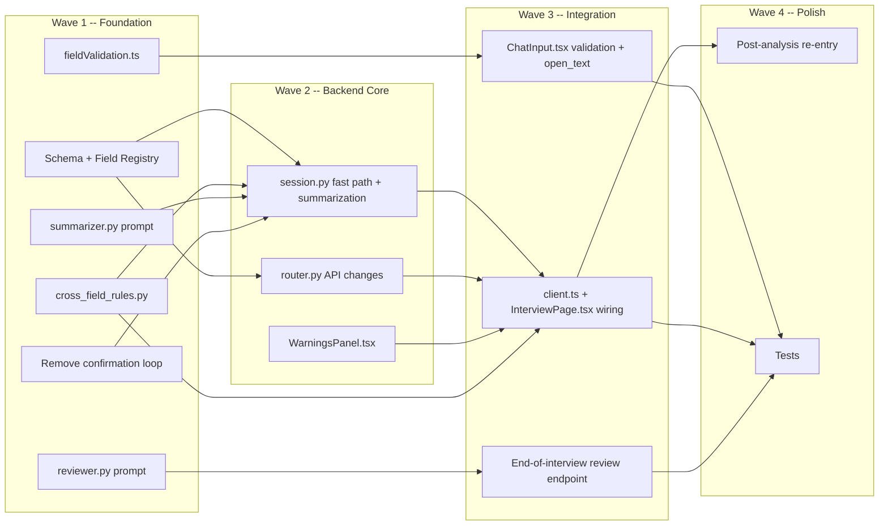

# Parallel Subagent Build -- Client-Side Validation Refactor

**Date:** 2026-02-22
**Design Doc:** [004-client-side-validation](../design/004-client-side-validation.md)
**Feature Branch:** `feature/client-side-validation`

## Strategy

Break a 17-task implementation plan into 4 dependency-ordered waves. Each wave launches multiple subagents in parallel, gated by a test checkpoint before the next wave begins. This minimizes wall-clock time while catching integration issues early.

## Dependency Graph

## Wave 1 -- Foundation (4 parallel subagents)

All standalone with no upstream dependencies. Launch simultaneously.

### Subagent 1A: Schema + Policy Engine

- Add `additional_considerations: ProvenanceField | None = None` to `backend/schema/canonical.py`
- Add field group priority 12 and question/optional templates to `backend/policy/field_registry.py`
- Add `additional_considerations` friendly name to `backend/policy/engine.py`
- Remove the `find_low_confidence_fields()` confirmation phase from `select_next_question()` in `backend/policy/engine.py` (lines 205-223) -- skip straight from missing-fields to optional-fields
- Update `_make_schema()` in `backend/tests/interview/test_session.py` if the new field requires it

### Subagent 1B: Frontend Validation Module

- Create `frontend/src/utils/fieldValidation.ts` with per-field validation rules (type, range, format) and `sanitize()` helper
- Standalone new file; no dependencies on other changes

### Subagent 1C: Cross-Field Rules + Prompts

- Create `backend/policy/cross_field_rules.py` with `CrossFieldWarning` dataclass and `run_cross_field_checks(schema)` function implementing all 6 rules from the design doc
- Create `backend/ai/prompts/summarizer.py` with `SUMMARIZER_PROMPT`
- Create `backend/ai/prompts/reviewer.py` with `REVIEWER_SYSTEM_PROMPT`
- All standalone new files

### Subagent 1D: Warnings Panel Component

- Create `frontend/src/components/interview/WarningsPanel.tsx`
- Right-side collapsible panel, badge count, per-warning display with rule name/fields/message/suggestion, responsive collapse to floating badge
- Props: `warnings: CrossFieldWarning[]`, `onFieldClick: (fieldPath: string) => void`
- Standalone new component; no dependencies

### Checkpoint

Run `python -m pytest backend/tests/ -v` to verify schema and engine changes before proceeding.

## Wave 2 -- Backend Core (2 parallel subagents)

Depends on Wave 1A (schema, engine) and Wave 1C (cross-field rules, prompts) completing.

### Subagent 2A: Session Fast Path + Summarization + Cross-Field Integration

- Update `respond()` in `backend/interview/session.py`:
  - Add `field_path` and `validated` parameters
  - Fast path: when both provided, use `_fallback_patch_for_target()` with confidence=1.0, skip LLM
  - Add summarization flow for `additional_considerations` field: detect target, call LLM with summarizer prompt, store summary + raw in `advisor_interview`
  - Add skip detection for "nothing else" / "no" / "skip" replies
  - Call `run_cross_field_checks()` at end of `respond()`, include warnings in result
- Update `InterviewTurnResult` to carry warnings

### Subagent 2B: Router API Changes

- Update `backend/interview/router.py`:
  - Add `field_path: str | None = None` and `validated: bool = False` to request model
  - Add `warnings: list[str] = []` to response model
  - Pass new fields through to `session.respond()`
  - Wire warnings from `InterviewTurnResult` into response

### Checkpoint

Run `python -m pytest backend/tests/ -v` to verify fast path and API changes.

## Wave 3 -- Integration (2 parallel subagents)

Depends on Wave 2 completing (backend API is stable).

### Subagent 3A: ChatInput Validation + Open Text Mode

- Update `frontend/src/components/interview/ChatInput.tsx`:
  - Import and call `validateField()` from `fieldValidation.ts` before `onSend()`
  - Show inline error message below input when validation fails
  - Add `"open_text"` input mode: multi-line textarea, placeholder, three buttons (Send, Nothing else, Run Analysis)
  - Add detection for `additional_considerations` target field in `detectInputMode()`

### Subagent 3B: Frontend Wiring + End Review

- Update `frontend/src/api/client.ts`: add `field_path` and `validated` to respond call, add `warnings` to response type
- Update `frontend/src/pages/InterviewPage.tsx`:
  - Track `targetField` from previous response, pass to ChatInput and API call
  - Integrate `WarningsPanel` into layout (chat + right panel when warnings present)
  - Store warnings in interview store state
  - Handle skip-to-analysis from open_text mode
- Add end-of-interview review logic in `backend/interview/session.py`: when `interview_complete`, call LLM with reviewer prompt, return findings

### Checkpoint

Run full test suite and lint frontend.

## Wave 4 -- Polish (2 parallel subagents)

Depends on Wave 3 completing (full flow is functional).

### Subagent 4A: Post-Analysis Re-Entry

- Add "Update Considerations" button on the dashboard/results page
- Wire navigation back to interview page with `additional_considerations` field re-opened
- Show existing summary as context; allow append/replace/clear
- Add "Rerun Analysis" action after update

### Subagent 4B: Tests

- Unit tests for `fieldValidation.ts` (per-field rules, sanitize)
- Unit tests for `cross_field_rules.py` (each rule, edge cases)
- Unit tests for session fast path (validated input skips LLM, fallback on parse failure)
- Unit tests for summarization flow (skip detection, LLM call, confirm/re-summarize)
- Integration test for full interview flow end-to-end
- Update existing `test_session.py` tests if signatures changed

### Checkpoint

Run full test suite. Verify all 17 todos are complete.

## Execution Summary

| Metric | Value |
|--------|-------|
| Total subagents | 10 across 4 waves |
| Max concurrent | 4 (Wave 1) |
| Critical path | Wave 1A -> Wave 2A -> Wave 3B -> Wave 4B |
| Checkpoints | 4 (one per wave) |

## Key Principles

1. **Dependency-first decomposition** -- group tasks by what they depend on, not by layer (frontend/backend)
2. **Standalone files first** -- new files with no imports from changed modules can run in the widest parallel
3. **Test checkpoints between waves** -- prevents cascading failures across subagents
4. **Critical path awareness** -- know which chain of tasks determines the minimum wall-clock time; prioritize those subagent prompts for clarity

## Lessons Learned

<!-- Append observations after the build completes -->
